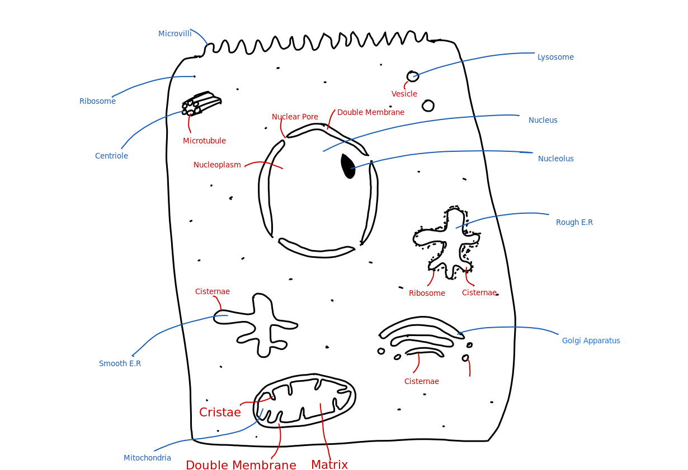

# Eukaryotes

- Eukaryotes have membrane-bound organelles

## Structure

---
## Definitions

Ribosome - Very small and made of RNA and protein.

Rough E.R - System of interconnected flat sacs bound by membranes 
	with ribosomes attached. Folds proteins that are transported along membranes.

Smooth E.R - System of interconnected flat sacs bound by membranes
	with no ribosomes attached. Synthesises lipids and steroids.

Lysosome - Spherical sacs bound by a membrane, with no internal structure.
	Contains digestive enzymes that break down worn our structures or invading cells.

Golgi Apparatus - Flattened curved membrane-bound sacs, or cisternae, formed by the fusion
	of vesicles that are often present at the edges. Modifies or packages proteins and lipids.
	Also makes lysosomes.

Mitochondria - Oval shaped with a double membrane. Inner membranes are folded into cristae
	that project into the matrix. Site of aerobic respiration.

Nucleus - Enclosed double membrane called an envelope, that is perforated by pores
	that enable substances to move in/out of the nucleus (mRNA). Contains chromosomes with genes
	that code for and control protein synthesis.

Nucleolus - Dense region found in the nucleus. Synthesises DNA.

Centriole - Hollow cylinders made of a ring of microtubules. <b>Found only in animal cells</b>
	Forms the spindle fibres during nuclear division.