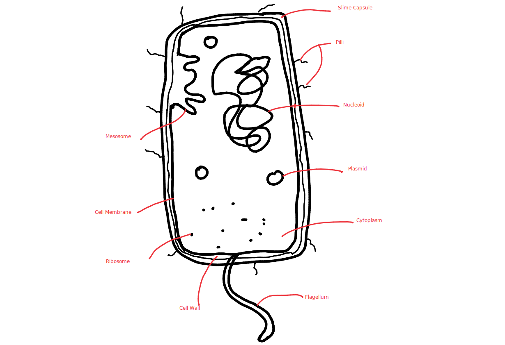

# Prokaryotes

- Prokaryotes do not have membrane-bound organelles

## Structure

---
## Definitions

Cell wall - Outer protective layer that gives the cell its shape

Slime Capsule - Slime layer that protects cell if engulfed,
	helps to retain moisture, and can be used to adhere to surfaces.

Plasmids - Circular rings of DNA

Pilli - Short hair-like structures used to adhere to surfaces.
	Are also used to exchange DNA with other prokaryotes.

Flagellum - Long threads used for swimming.

Ribosome - Site of protein synthesis

Nucleoid - Large DNA loop that stores genetic information in the
	cytoplasm.

Mesosome - Infolding of the plasma membrane where the enzymes
	responsible for respiration are located.