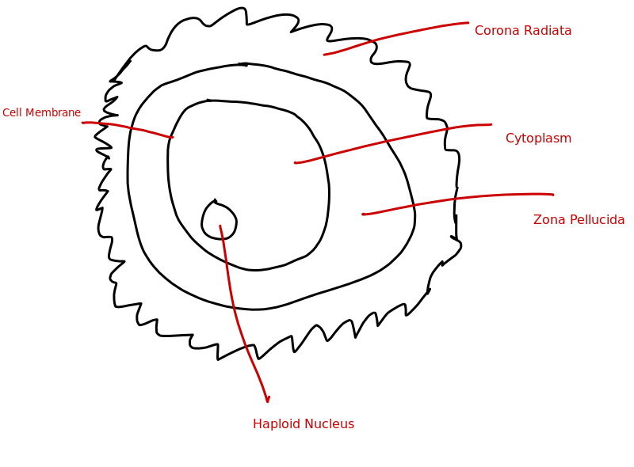
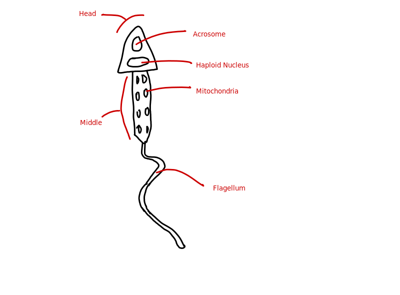

# Gametes

## Egg:

<table>

	<tr>
		<th>Structure</th>
		<th>Function</th>
	</tr>

	<tr>
		<td>Cytoplasm</td>
		<td>
			Contains the nutrients required to grow the embryo.
			This includes proteins, carbohydrates, etc.
		</td>
	<tr>

	<tr>
		<td>Zona Pellucida</td>
		<td>
			Thick layer that the sperm must go through to fertilise the egg.
		</td>
	<tr>

	<tr>
		<td>Corona Radiata</td>
		<td>
			2-3 layers or follicles attached to the zona pellucida.
			This is the main protective layer.
		</td>
	<tr>

</table>

---

## Sperm:

<table>

	<tr>
		<th>Structure</th>
		<th>Function</th>
	</tr>

	<tr>
		<td>Acrosome</td>
		<td>
			A lysosome that contains digestive enzymes. These are used to break
			down the zona pellucida so the sperm can enter.
		</td>
	<tr>

	<tr>
		<td>Mitochondria</td>
		<td>
			Where aerobic respiration occurs. There are many to release the large
			amount of energy required to propel them with the flagellum.
		</td>
	<tr>

	<tr>
		<td>Flagellum</td>
		<td>
			Allows the sperm to propel itself to the egg.
		</td>
	<tr>

</table>