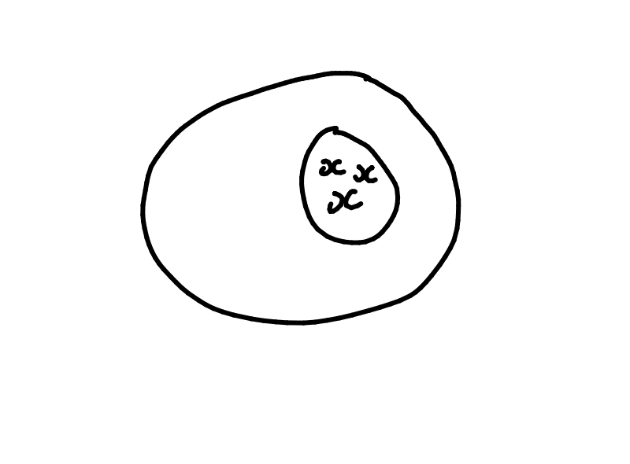
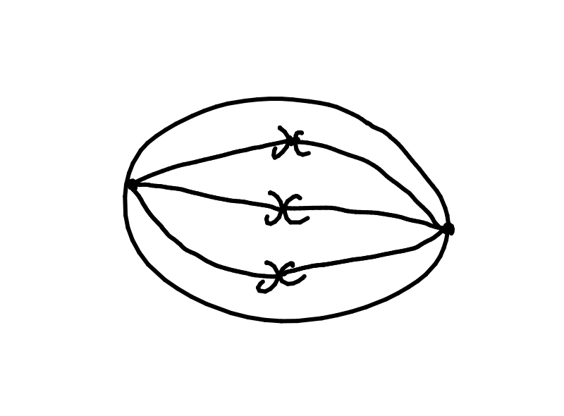
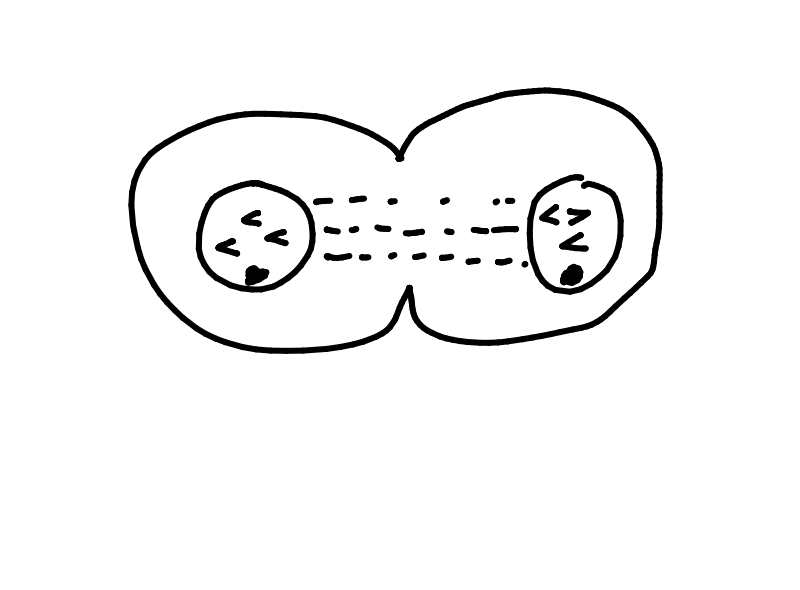
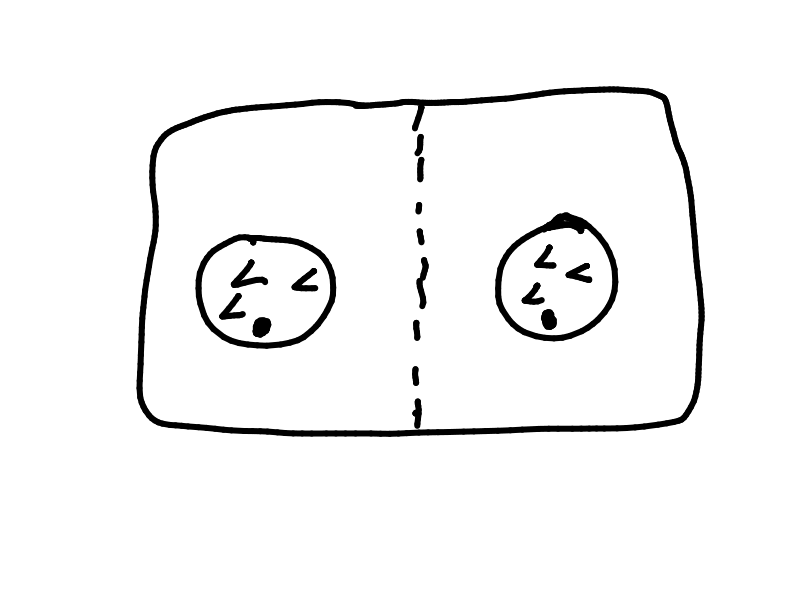

# Mitosis

The cell cycle is the total lifetime of the cell.

There are two phases in the cell cycle:
- Interphase
- Mitotic phase

## Interphase:

- This is where many metabolic processes occur.

- G1 - growth stage 1 - cell prepares for replication by
	doing protein synthesis and organelle production.

- S - synthesis stage - DNA replicates

- G2 - growth stage 2 - cell prepares for division.
	This means protein synthesis and microtubule production.

## Mitosis:

 - This is the division of the nucleus.

 - Prophase - replicated chromosomes condense
 	and become visible. Centrioles move to opposite
 	poles and the nuclear membrane breaks down.

	

 - Metaphase - replicated chromosomes line up at the cell
 	equator. Spindle fibres connect centrioles to centromeres.

	

 - Anaphase - centromeres split, sister chromatids are pulled apart
 	to opposite poles of the cell as the spindle fibres contract.

	

 - Telophase - spindle fibres disperse, nuclear membranes
 	reform around each set of chromosomes.

	

## Cytokenisis:

 - This is the division of the cytoplasm.

 - In animal cells, a ring of filaments form
 	around the equator, and tighten to split the cell.

 	

 - In plant cells, a new cell wall forms inside the
 	existing cell to split it.

 	
