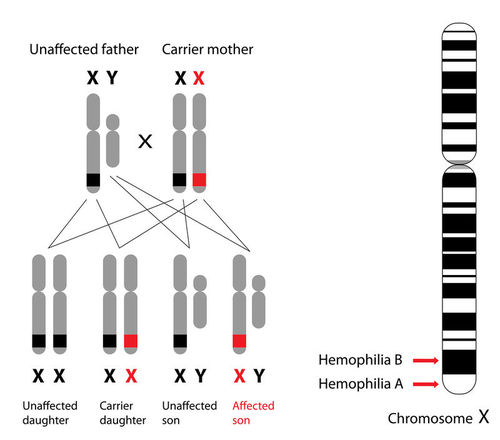

# Sex linked alleles

This is where an allele is located on one of the sex chromosomes.

Female mammals have 2 X chromosomes, male mammals have an X and a Y.

Female birds have an X and a Y chromosomes, male birds have 2 X chromosomes.

Y chromosomes are smaller so carry fewer genes. This means that
males are more likely to develop genetic diseases that are located
on the sex chromosomes. This is because females have 2 copies of
all the genes, whereas males only have 2 copies of some of the genes.
An example of this is haemophilia, as seen below.

