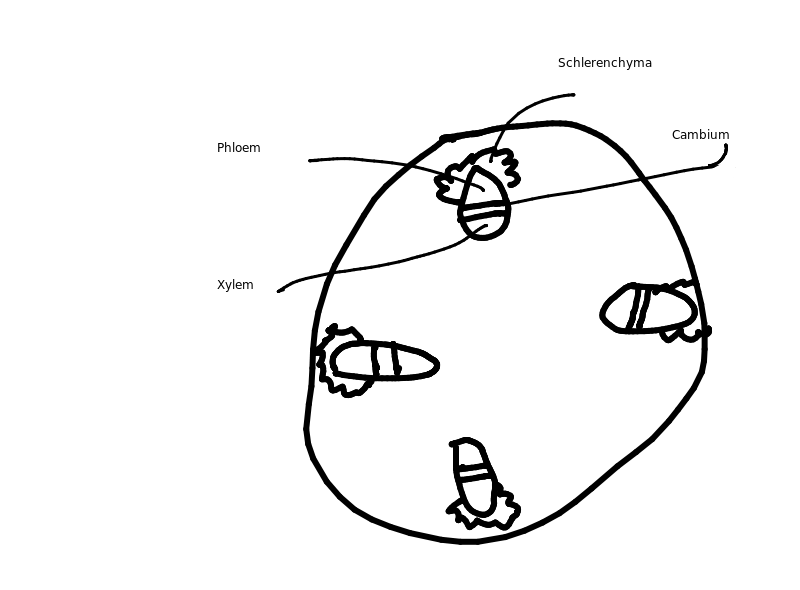
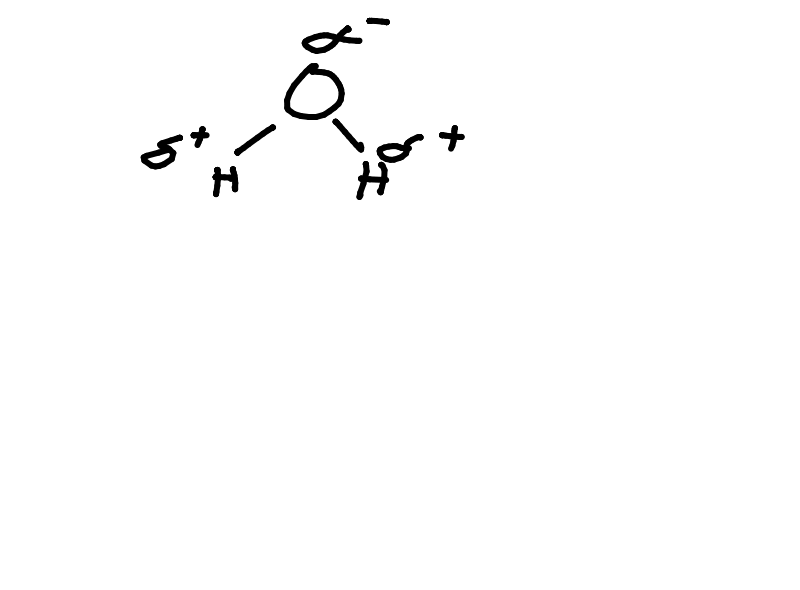

# Plant Materials

Plant cells are turgid - meaning full of water.
Cell walls are strengthened with cellulose.

## Tissues

### Xylem:

Transports water and minerals.

One-way transport - only goes up.

Open at both ends of the tube.

Dead cells.

Lignified (contains lignin for support).

Strong so that they do not collapse.

### Phloem:

Transports organic molecules through translocation. This is an active process
as energy is required to create a pressure difference.

Moves substances from source (roots, etc) to sink (leaves, etc).

Two-way transport.

### Stem:

The cambium is an area that could become phloem or xylem.

The sclerenchyma is a column of lignified cells that supports the bundles.
It is also waterproof.

## Organelles

| Organelle         | Function                                                                                                                                                                                                                                     |
|-------------------|----------------------------------------------------------------------------------------------------------------------------------------------------------------------------------------------------------------------------------------------|
| Cell Wall         | Supports the cell, as plants have no skeletons.                                                                                                                                                                                              |
| Middle Lamella    | Adhesive layer that helps to stick cells together.                                                                                                                                                                                           |
| Plasmodesmata     | Channels in the cell wall to link cells together. Allows transportation of substances between cells, as well as communication.                                                                                                         |
| Pit               | Thin areas of the cell wall. Arranged in pairs that are lined up when cells are together. Allows substance transfer between cells.                                                                                                     |
| Chloroplast       | Site of photosynthesis. Has 2 parts: the stroma (liquid) and the grana (structures inside the organelle). Photosynthesis occurs in both.                                                                                               |
| Amyloplast        | Starch is stored here. Can also convert starch to glucose when needed.                                                                                                                                                                       |
| Vacuole/tonoplast | Vacuole contains the cell sap, ans keeps the cell turgid. It can also stop the breakdown of the cell and help to isolate unwanted chemicals. The tonoplast if the membrane of the vacuole, so controls what leaves/enters the vacuole. |

## Cellulose

In cellulose, $\alpha$ and $\beta$ glucoses are bonded by flipping the $\beta$ glucose so
that the two OH groups are adjacent to bond.

Chains of cellulose form hydrogen bonds, meaning the structure is quite strong.
These chains bundle together to form microfibrils.

Hemicellulose and pectin (calcium pectate) stick cellulose microfibrils to form fibrils.

## Water

Water:

- Has surface tension and cohesion through hydrogen bonding.

- Sticks to other water molecules, so is good for transport in xylem/phloem, as it is polar.

- Is a good solvent because it is polar.

- Reactions can occur in solution.

- High specific heat capacity, so prevents rapid temperature changes.

## Minerals
Plants need the following minerals to survive:

- Nitrates - make up amino acids, chlorophyll, nucleic acids, ATP and some hormones.

-  Calcium - without calcium, there is stunted growth. Affects cell walls that are made from
	calcium pectate, and cell membrane permeability.

- Magnesium - without magnesium, leaves turn yellow, as magnesium is required for making
	chlorophyll.

