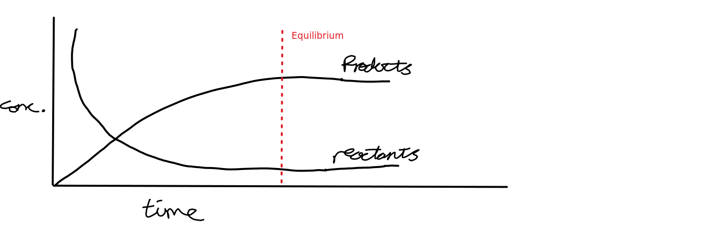
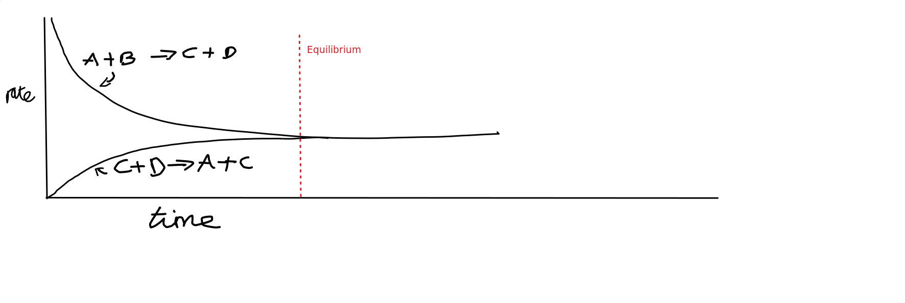

# The Equilibrium Constant

This is a calculation showing the position of equilibrium in a reversible
reaction.

$K_c$ is the equilibrium constant.

For the following equation:

$aA + bB \rightleftharpoons cC + dD$

In $aA$, $a$ is the moles in A, and $A$ is the concentration of A.

$K_c = {{[c]^C[D]^d}\over{[A]^a[B]^b}}$

$K_c = {{Products}\over{Reactants}}$

Equilibrium is where the rates both level out, and the concentration of each
reaction becomes the same.

Where E is equilibrium, P is products, and R is reactants.

# Calculating $K_c$

For the equation $H_2 + I_2 \rightleftharpoons 2HI$

With concentrations of:

- $H_2$ = 0.140 $moldm^{-3}$
- $I_2$ = 0.040 $moldm^{-3}$
- $HI$ = 0.320 $moldm^{-3}$

$K_c = {{[HI]^2}\over{[H_2]^1[I_2]^1}} = {{0.32^2}\over{0.14^1 \times 0.04^1}} = 18.3$

This specific example has no units as units are also taken into account in the division.

Many questions will result in units.

$Units = {{(moldm^{-3})^2}\over{(moldm^{-3}) \times (moldm^{-3})}} = 0$