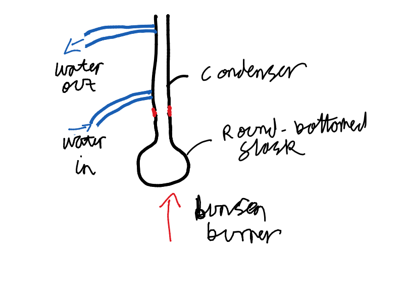
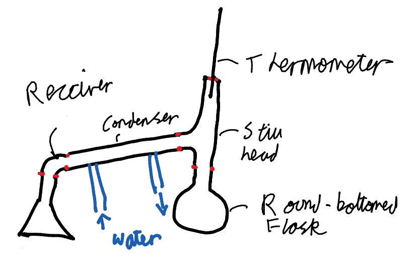

# Practical Techniques

## Reflux:

This apparatus is used to increase the rate of reactions
by increasing temperature.

The solution is boiled, but this would cause the solvent to be
lost. Instead, a condenser is placed above the flask (can be round-bottomed
or pear-shaped).

A setup consists of the following pieces of equipment:

 - Round-bottomed/pear-shaped flask
 - Condenser tube
 - Stand with clamp
 - Heat source - generally a Bunsen burner

The joint between the condenser and the flask must be greased to stop solvent leakage,
but to allow the joint to leak if the alternative is an explosion.

Water is always input at the bottom.

---

## Distillation

This is used to separate a pure liquid from any impurities.

A setup consists of the following pieces of equipment:

 - Round-bottomed/pear-shaped flask
 - Condenser tube
 - Rubber Tubing
 - Heat source - generally a Bunsen burner
 - Stand with clamp
 - Screw-cap adapter
 - Receiver adapter
 - Still head
 - Thermometer

The water input is always at the lowest point of the setup.

---

## Purifying

Purification is used to separate two liquid layers, where one is organic and the other is not.

Equipment is:

 - Separating funnel
 - Water
 - (Sodium Carbonate)

The steps are:

1. Shut the valve on the separating funnel
2. Pour the liquid mixture into the funnel
3. Leave until the layers have settled
3. Add some water, see which layer increases in volume. This is the aqueous layer.
5. Put a flask under the output of the funnel, and release the valve until all of the bottom layer has 
left the funnel.
6. Put a different flask and repeat 5 with the 2^nd layer
7. If there is acid in the solution, solid calcium carbonate can be added, 
this will neutralise the acid, releasing carbon dioxide.

---

# Drying

Water needs to be removed from organic products, and to do this,
 an anhydrous inorganic salt is added, which absorbs water.

Examples:

| Drying Agent       | Use                 |
|--------------------|---------------------|
| Calcium Chloride   | Drying hydrocarbons |
| Calcium Sulphate   | General drying      |
| Magnesium Sulphate | General drying      |

Steps:

1. Add the liquid to a conical flask.
2. Add some drying agent to the flask with a spatula, swirl to disperse.
3. Put a stopper on the flask and leave for 10 minutes to stop the solvent evaporating.
4. Add more drying agent until the agent no longer clumps together.
5. Separate the solid from the liquid by decanting.

---

# Redistillation

This is where a distillation is done once more after a first distillation, 
because the two liquids could have very close boiling points.

The distillation apparatus is cleaned, dried, and set up once more, 
then the liquid is distilled, and only the liquid that is transferred at the boiling point of
the target substance is collected.
