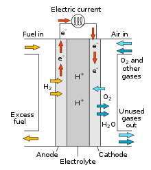

# Batteries and Fuel Cells

Cells and batteries have two electrodes of different potentials
to generate a potential difference.

There are 3 types:

- Primary
	- Non-rechargeable.
	- One-use.
	- Oxidation and reduction occur until the reactants are used up.
	- Used in low current/long storage devices, such as clocks.
	- These are alkaline batteries.

- Secondary
	- Rechargeable.
	- Reaction is reversible.
	- Examples are lead acid, NiCd and Li-Ion/LiPo.

- Hydrogen Fuel Cells
	- Hydrogen enters the anode compartment.
	- Hydrogen loses electrons to become $H^+$ ions.
	- The $H^+$ ions move to the cathode.
	- Oxygen goes into the cathode compartment.
	- At the cathode, $O_2$, $e^-$ and $H^+$ react to form $H_2 O$
	- At the same time, the $e^-$ goes to the cathode through the wire,
		forming a current.
	- Electricity is generates as long as $H_2$ and $O_2$ are there.

Hydrogen is currently generated from crude oil.

Hydrogen fuel cells can either have acid or alkali electrolytes, but both result
in the same whole equation with the same electrode potentials.