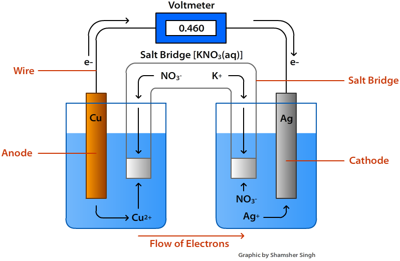

# Electrochemical Cells

These convert chemical energy into electric energy.

## Half Cells

These contain the chemicals that perform a redox reaction. An electrochemical
cell can be formed by connecting two different half cells with a salt bridge such as potassium nitrate (V), which
allows ions to flow between two solutions.

Simple half-cells are comprised of a metal rod in a solution of its aqueous ion, e.g.
here the two cells are $Cu$/$Cu^{2+}$ and $Ag$/$Ag^+$

If one of the cells is only ions, such as $Fe^{3+} + e^- \rightarrow \leftarrow Fe^{2+} $,
a platinum electrode is used in a mixed solution of both ions.

In electrochemical cells the half-equations are always written in the same format - a reduction.

The position of equilibrium between the two reactions determines the voltage, as the larger voltage
difference means a higher overall voltage.

Electrochemical cells will have a positive and negative terminal, and a voltage.

In an oxidation and reduction there is a current flow. The energy flow in the cell is called
the $E_{cell}$.

All half cells are compared to a hydrogen half cell that has an electrode potential of 0.0V.
The hydrogen is pumped around a platinum electrode.

$2H^+ + 2e^- \rightarrow H_2$

When two half cells are put together, the move positive cell is the overall positive terminal, so
the more negative equation is reversed when the equation is put together.

## Standard Contidions

- 298 K
- 100 kPa
- 1 $moldm^{-3}$