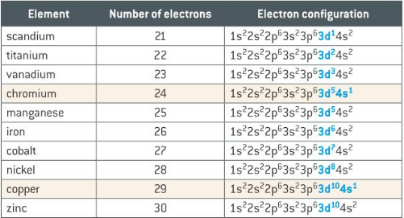

# D-Block Elements

The d-block is between groups 2 and 13 on the periodic table. 
They are all metallic.

As seen here, $Cr$ and $Cu$ only half fill the $4s$ sub-shell, as it is thought that a half-filled
or fully-filled $3d$ sub-shell is more stable.

# Transition Elements

These are d-block elements that form at least one ion with a partially filled d-orbital.

$Sc$ and $Zn$ are d-block but do not fit this criteria, so are not transition elements. This is because
$Sc$ only forms $Sc^{3+}$ by losing its 2 $4s$ electrons and one $3d$ electron, and $Zn$ only forms
$Zn^{2+}$ by losing its two $4s$ electrons. This means both have full d-orbitals, e.g. $Sc^{3+}$ has a $3p^6$ orbital
but no $3d$ or $4s$ orbitals.

## Properties

### Variable Oxidation States

Transition elements can form more than 1 oxidation state. This is because they lose the
$4s$ electrons first, then a varying number of $3d$ electrons afterwards.

Every transition metal can form a +2 ion, but others like $Mn$ can form up to a +7 ion.

These oxidation states often have a characteristic colour, and will cause any liquid they are
dissolved in to change colour also.

Colour changes are caused by the ions absorbing different light wavelengths, e.g.
$Cu^{2+}$ absorbs red light and transmits blue light, making it appear blue if white light is
shone on it.

### Catalysts

Transition elements are used as catalysts in many reactions, including the Haber process  where an iron catalyst
is used.

$N_2 + H_2 \leftrightharpoons 2NH_3$