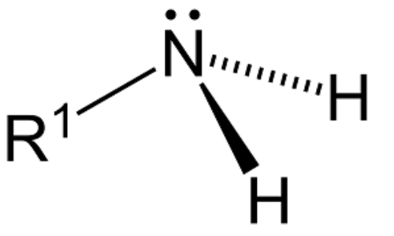
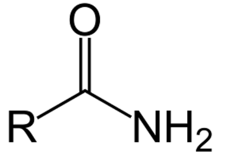
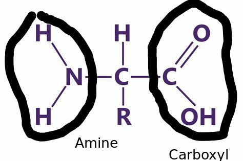

## Amines

Has a lone pair.

Can be primary, secondary and tertiary.

Lone pair makes amines basic.

## Amides

Similar to carboxilic acid with $NH_2$ at the end.

## Amino Acids

Contain 2 functional groups: amine and carboxyl.