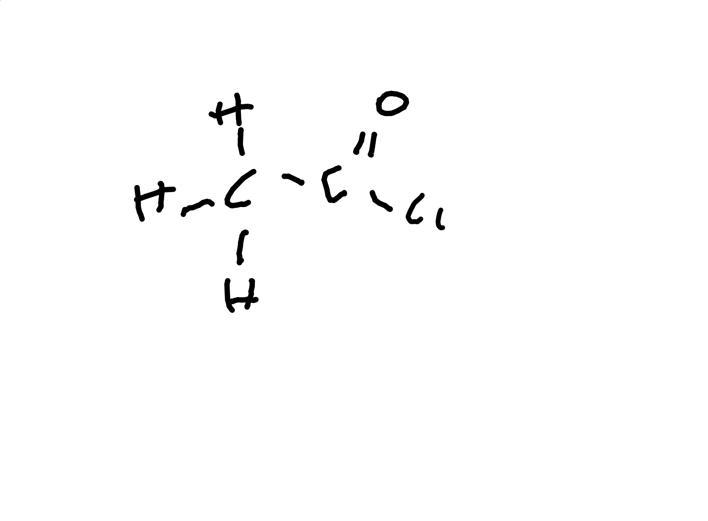

# Carboxilic Acids

Can be identified by reaction with sodium carbonate. No other organic chemical can react with this.

## Derivatives

### Acyl Chloride

$OH$ is replaced by a $Cl

Is Polar

Conditions are dry, ract with $SOCl_2$

$CH_3 COOH + SOCl_2$ -> $CH_3 COCl + HCl$

Can be reacted with $H_2 O$ to re-form carboxilic acid and $HCl$.

Can refluxed with alcohol or phenol in dry conditions to form ester and $HCl$.

Can be reacted with excess ammonia at low temperatures to form $NH_4 Cl$ and an amide.

In anhydrous conditions these can form an N-substiruted amide and an ammonium chloride.