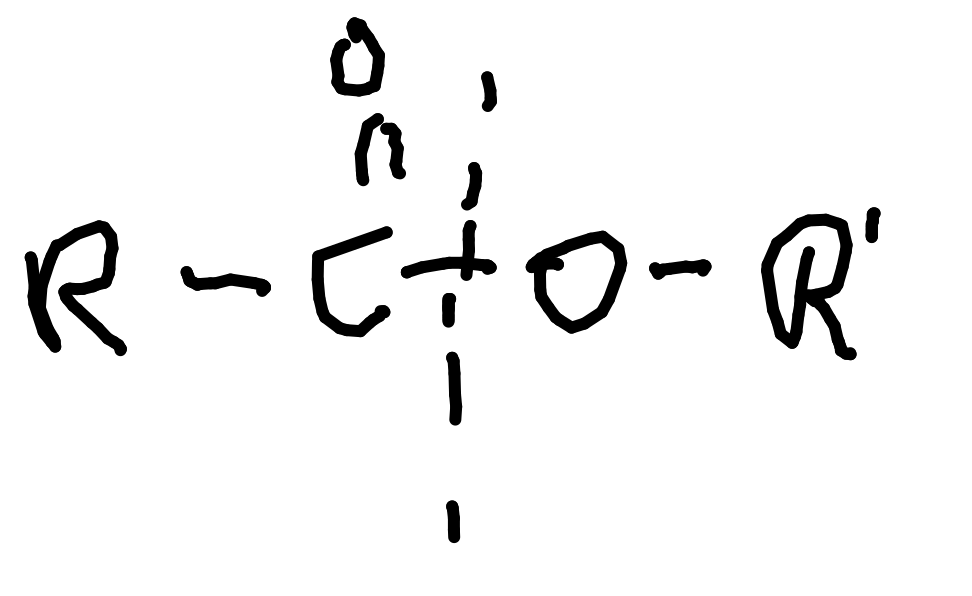
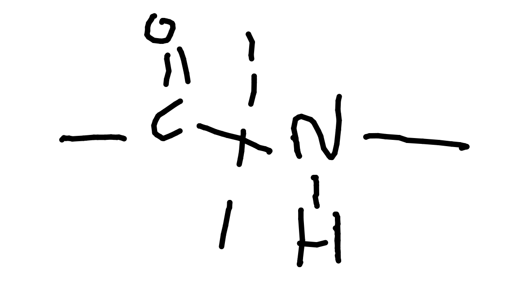

# Polymerisation (TODO)

# Hydrolysis

## Ester Hydrolysis

With acid: forms original molecules.

With alkali: forms salt and alcohol.

## Amide Hydrolysis

With acid: forms original molecules.

With alkali: forms salt and amine

