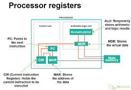

# Processor Components

## Parts

#### Control Unit

Coordinated CPU activities.

Controls flow of data.

Accepts instruction, decodes it, executes it, then stores the result in memory
or registers.

#### Buses

Parallel wires connecting two or more components.

Typically 8, 16, 32 or 64 lines.

CPU sends the required address in memory to the **address bus**.

The data is returned to the CPU through the **data bus**.

Control signals are sent through the **signal bus**.

The data bus, the control bus and the address bus are known as the **system bus**.

Only one device can transmit along each bus at one time.

Control bus:

- Bi-directional
- Transmits command, timing and status information between system components.
- Control lines include:
	- Bus request - device requesting use of the data bus.
	- Bus grant - CPU has granted access to the data bus.
	- Memory write - data on the data bus is written to a specified location.
	- Memory read - data in the specified location is put onto the data bus.
	- Interrupt request - a device requesting access to the CPU.
	- Clock - used to synchronise operations.

Data bus:

- Bi-directional.
- 8, 16, 32 or 64 lines.
- Moves data and instructions between system components.

Address bus:

- Transmits memory addresses at the size of a word.
- So data can be retrieved and sent to the processor.

Words are fixed size digits, usually being 16, 32 or 64 bits.

#### ALU

Operations include addition, subtraction, multiplication and division.

Can carry out operations on floating point numbers.

Can do binary shifts as well as boolean operations such as and, or, not and xor.

#### Registers

Very high speed memory.

Small memory location used for storing data.

Results of ALU operations are stored in registers.

There are typically 16 general purpose registers in a CPU.

Older and embedded systems will use a single accumulator, which is a single register
instead of the multiple registers.

Program counter (PC):

- Holds the address of the next instruction.
- Can be either the next instruction in a sequence or the address to an instruction
to branch to.

Current instruction register (CIR):

- Holds the current instruction.
- Holds the operand and the opcode.

Memory address register (MAR):

- Holds the memory address where data is to be written to or read from.

Memory data register (MDR):

- Used as a buffer for the main memory.

## Fetch-Decode-Execute cycle

1. Address of next instruction copied from PC to MAR.

2. Instruction at that address is copied to the MDR. At the same time the PC is
	incremented to the next instruction.

3. The contents of the MDR are copied to the CIR.

4. The instruction in the CIR is decoded. The instruction is split into the opcode
	and the operand.

5. The opcode is executed on the operand.

