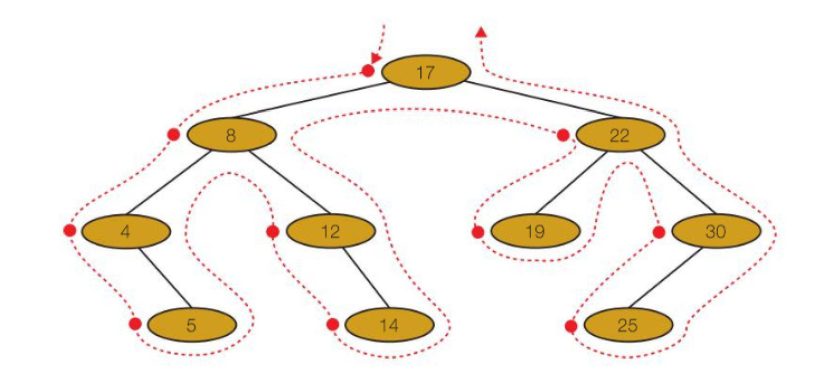
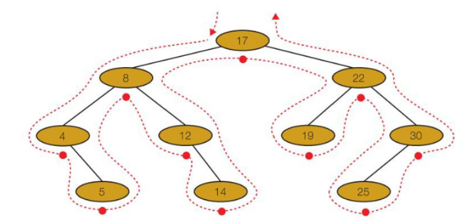
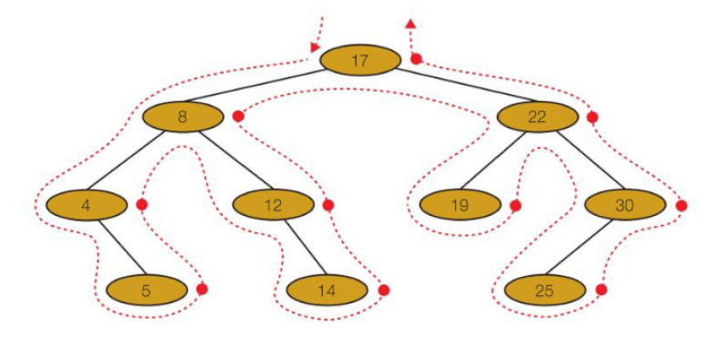

# Trees

These are data structures that are used to store heirachical data.

The root node is the start node, that has no incoming nodes.

A subtree is a tree inside a tree, which can be independently stored.

## Binary Trees

These are used to perform a binary search over data.

They are constructed by:

- First item is the root.
- For each remaining item:
	- Visit the root.
	- Branch left if the item is less than the current node, and right if the item is more.

## Traversal

#### Pre-Order

#### In-Order

#### Post-Order

## In An Array

These can be represented in an array by storing the index, the left node, the right node and
the data.