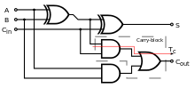
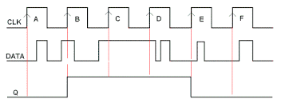

# Adders and Flip-Flops

## Half Adder

These take two inputs, A and B, and XOR them to form output S, and
carry bit C. They cannot take 3 inputs so are only useful for adding 2 bits only.

$S = A \veebar B$

$C = A \wedge B$

## Full Adder

This is a combination of 2 half-adders.

It takes in 3 inputs, A, B and a carry input, and outputs the sum and a carry value.

Full adders can be connected together so that the carry bit of the first adder is
input into the carry bit of the second adder and so on, to make large adders for
numbers with many bits.

## Clocks

These are used to synchronise computer components.

They change state at regular intervals.

## Flip-Flops

These are used to store a bit.

There are 2 inputs - a clock signal and a control input "D".

A D-type flip-flop is an edge-triggered flip-flop, so only can change values when
the clock at a rising edge.

The value cannot change when the clock is not at a rising edge, so can store data.

Flip-flops are used to store 1 bit of data.

Register memory is constructed using many flip-flops connected together.