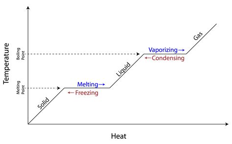

# Changing State

Solid -> gas = deposition

When state changes, temperature increase stops.

Here, a steeper gradient means faster heating.

## Latent Heat

Specific latent heat - energy needed to change state.

Specific latent heat of fusion - energy to melt.

Specific latent heat of vapourisation - energy to evaporate.

$q_{(energy, J)} = m_{(mass, kg)}L_{(latent\ heat, Jkg^{-1})}$

Time to change state $\propto$ specific latent heat.