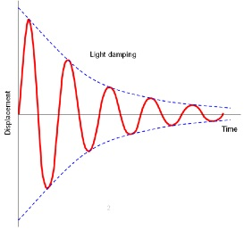
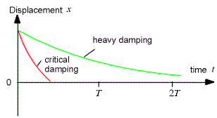

# Damping

A damped oscillator is where friction is not negligible, therefore maximum amplitude is not constant.

## Light Damping

Small amount of friction.

Each oscillation has slightly lower amplitude.

## Heavy Damping

Friction does not allow more oscillations.

Displacement returns linearly to equilibrium.

## Critical Damping

Forces oscillations to stop as fast as possible.

Returns quickly to equlibrium

