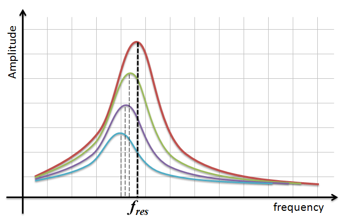

# Oscillations

Oscillations are moving backwards and forwards at a constant frequency.

## Pendulums

Mass is independent of frequency.

Swing angle independent of frequency.

Amplitude is maximum displacement from the centre.

A free oscillation is where there is no friction.

Acceleration is directly proportional to acceleration **in the opposite direction**.

$T_{(time\ period, s)} = 2\pi \sqrt{{L_{(length, m)} \over g_{(gravity, Nkg^{-1})}}}$

A displacement/time graph for SHM is sinusoidal.

$x = A \cos{(2\pi ft)}$ **use radian mode on calculator**.

$\therefore v  = - 2\pi f A \sin{(2\pi ft)}$

## Calculating g From a Pendulum

Get pendulum with set weight.

Vary cord length.

At each lengh measure the time period for 10 oscillations then divide by 10 to find 1 oscillation.

Form a linear graph of $T^2 = {
{4 \pi^2}
\over
{g}
} \times L$

Plot a graph of $T^2$ against $L$.

$\therefore gradient = {
{4 \pi^2}
\over
{g}
}$

## Springs

$T = 2\pi \sqrt{m \over K}$

Better than pendulum as pendulum only works at less than 10°.

## Forced Oscillations

Forced oscillation - applying a periodic force to a system at the same frequency as the force period.

Natural frequency - the frequency that an object oscillates at when an initial displacement is applied.

Resonance - an ever-growing amplitude caused by applying a periodic force with the same period as the natural frequency.

Resonance curves show the amplitude increasing drastically when frequency hits the natural frequency.

