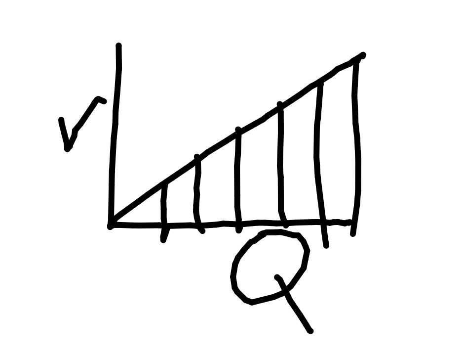
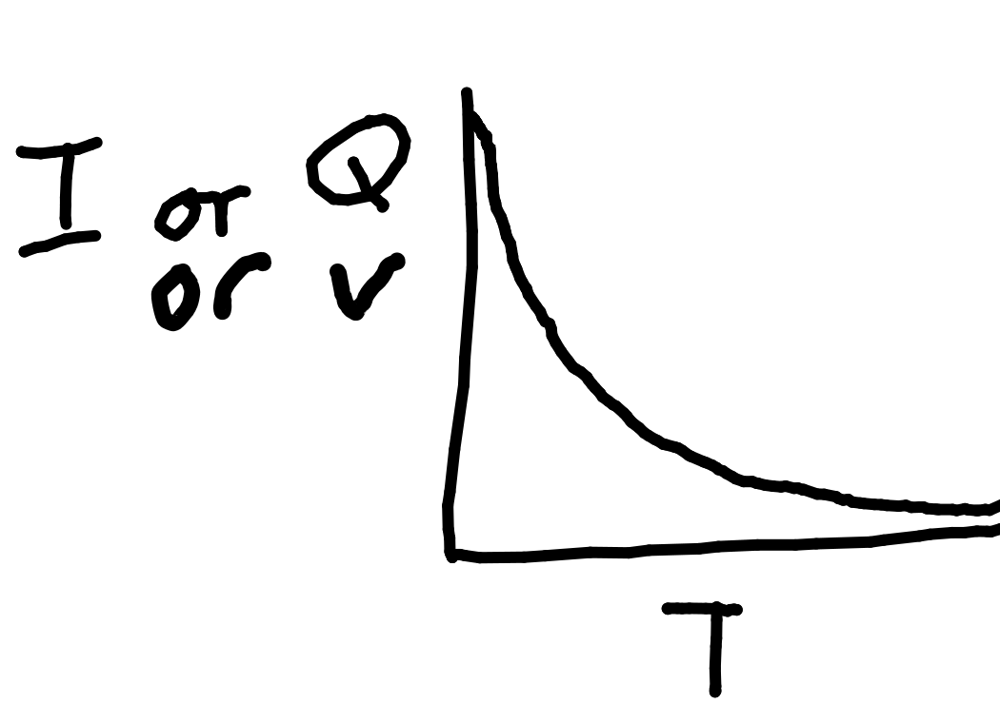
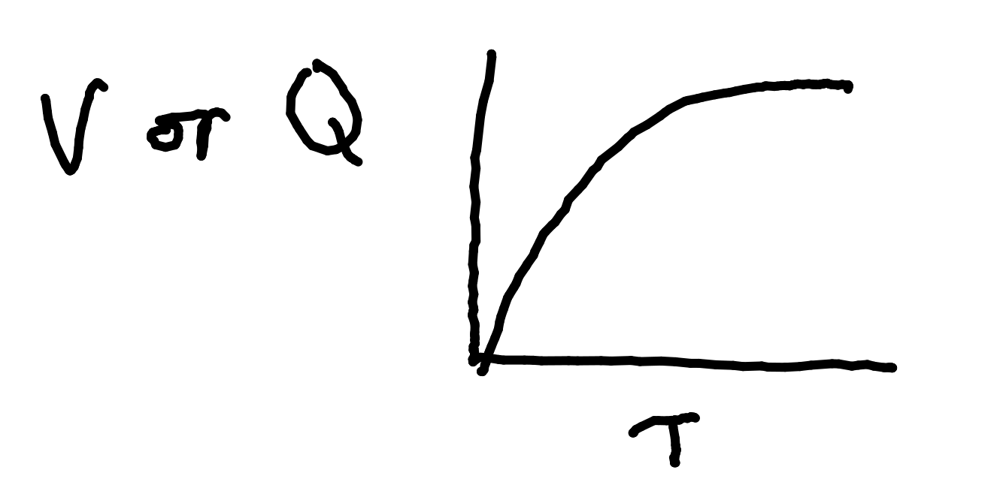
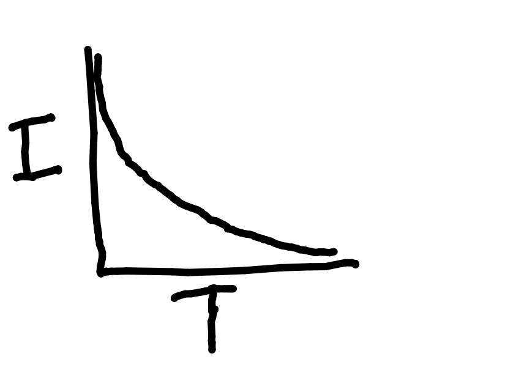

# Capacitors

Charge is stored by having 2 conductive plates separated by a thick, insulated sheet (the dielectric). This results in 2 equal and opposite charges on the plates.

Ideal capacitors have:

- Infinitely large and flat plates.

- Plates extremely close without charge being able to flow.

Capacitors have a rolled design to have very wide plates.

Applying a voltage charges the capacitor.

At maximum charge, the dielectric breaks down and charge can flow.

## Dielectrics

Charge on the plates induces a polarising effect:

- Orientation polarisation - covalent molecules' dipoles align due to London forces (occurs 1^st )

- Ionic polarisation - ions align with the field. (occurs 2^nd )

- Electronic polarisation - electrons displace and align.  (occurs 3^rd )

## Capacitor Uses

Smoothing variable voltage inputs for sensitive circuits.

Short-term backup power to allow safe power-off.

Filter away certain unwanted power frequencies.

## Capacitance

This is the charge stored per unit p.d.

$250 \mu F = 250 \mu C$ per volt.

The unit of capacitance is the Farad, F.

$C_{(capacitance, F)} = {
{A_{(area, m^2)} \epsilon_0 \epsilon_r}
\over
{d_{(distance\ between\ plates, m)}}
}$

## Calculating Capacitance

Get a capacitor.

Apply various voltages to capacitor.

Measure current over time, calculate charge with $Q = it$.

Plot a graph of charge against voltage, gradient is capacitance.

$Q = Cv$

## Energy Stored in a Charged Capacitor

Capacitor stores only half the energy that the battery provides.

E.g. here area of V/Q graph = ${1 \over 2} base \times height = {1 \over 2}QV$

Battery provides $QV$, so capacitor stores half what battery provides.

## Capacitor Discharging

Capacitor discharges exponentially as voltage drops, which causes current to drop as $V=IR$ and resistance is constant.

The general formula of this graph is: $Q_t = Q_0 e^{-{1\over t}}$

## Capacitor Charging

$Q = Q_0 (1-e^{-{T\over{RC}}})$

$V = V_0 (1-e^{-{T\over{RC}}})$

$I = I_0 e^{-{T\over{RC}}}$

Current decreases over time because the voltage is the sum of the resistor voltage and capacitor voltage. V stays the same but capacitor voltage decreases. This means resistor voltage increases, so resistor current decreases because $V=IR$.

### Time Constant

Time constant, $\tau = RC$.

This is the time at 37% of the initial current or charge.

This is because when $\tau = RC$:

$T = \tau$

$Q = Q_0 e^{-{1\over t}}$

$Q = Q_0 e^{-{1}}$

$e^{-1} = 0.37 \therefore Q = 0.37 \times Q_0$