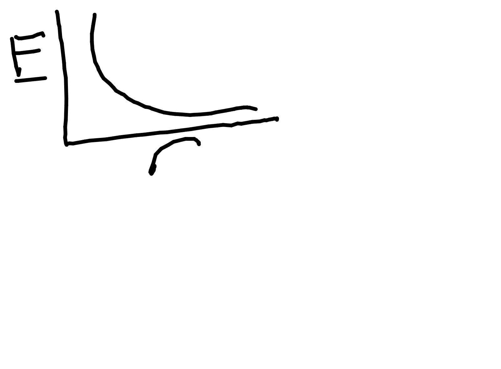
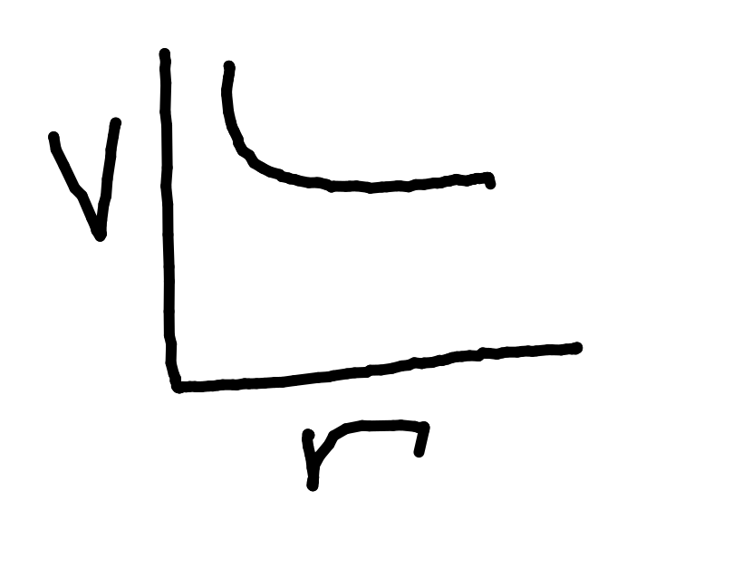

# Electric Fields

Arrows on an electric field diagram show what the ^+ ve charge would do.

Arrows extend from ^+ ve to ^- ve.

Can be attractive or repulsive.

Repulsive forces are negative, attractive forces are positive.

Greater charge = stronger electric field.

Field strength $\propto$ Charge per unit area. ($E \propto {{Q}\over{A}}$)

$F = QE_{(Electric\ field\ strength/NC^-1)}$

$W_{(Work)} = F_{(Force)}d_{(Distance)}$

$V = {
{W_{(Work)}}
\over{Q}
} = {
{Fd}
\over{Q}
} = {
{QEd}
\over{Q}
} = Ed$

$\therefore E_{/Vm^-1} = {
{V_{(Voltage)}}\over {d_{Distance)}}
}$

$E_{/NC^-1} = {F \over Q}$

$1 NC^{-1} = 1 Vm^{-1}$

## Coulomb's Law

Force acting on $Q_1$ and $Q_2$ is equal and opposite.

$F = {
{1}
\over
{4\pi \epsilon_0}
}
\times{
{Q_1 Q_2}
\over
{r^2}
}$

## Point Charges

Object is a point charge only if the particle is very small compared to the distance between points.

## Graphs

E/r:

Area under = Work per unit charge.

V/r:

