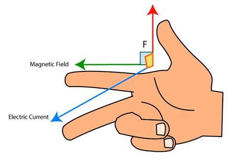
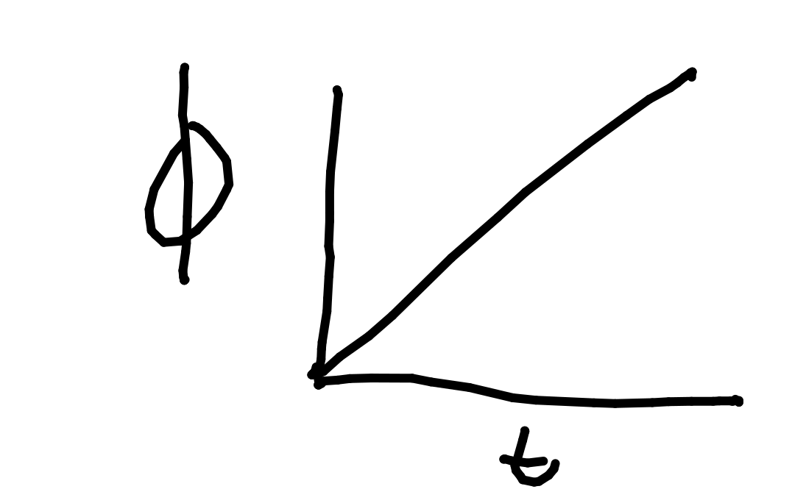
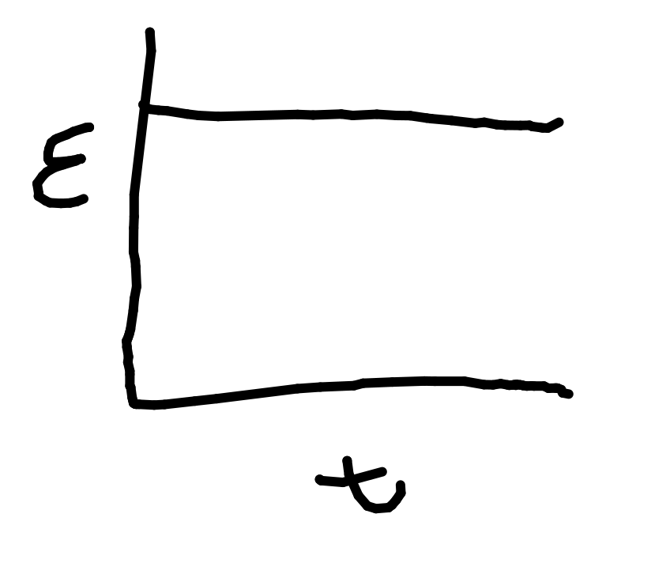

# Electricity Generation

EM induction - emf is induced when a wire passes through a magnetic field. If this wire is part of a complete circuit, current flows in the wire.

Emf - electromagnetic force / electromagnetic flux.

Emf is not induced if the wire crosses parallel to the field lines.

Maximum emf is induces when the wire is perpendicular to the field lines.

Generator - wire moves in magnets.

Dynamo - magnet moves in wires.

## Fleming's Right Hand Rule

Thumb - Force/Motion.

Index finger - Magnetic Field.

Middle Finger - Electric current flow (^+ ve to ^- ve).

## Lenz's Law:

"Electric current induced in a conductor by a changing magnetic field is such that the magnetic field created by the induced current opposes changes in the initial magnetic field."

When a magnet is pushed into wire coil, current is created.

This current then creates a magnetic field, in the opposite direction. This opposes the original magnetic field.

## Magnetic Flux

$\Phi_{(magnetic\ flux, Wb)} = B_{(magnetic\ flux\ density, T)}A_{(area, m^2)}$

Emf is the rate of change of magnetic flux.

$\therefore \epsilon = Bl_{(length, m)}v_{(velocity, ms^-1)}$

## Magnetic Flux Linkage

$N\Phi = BAN$

$N\Phi = BAN \cos(\theta)$

Where $N$ is the number of turns (no units).

As $N\Phi = BAN \cos(\theta)$, $\theta$ changes over time.

Therefore as $\Phi$ changes, $\theta$ changes.

$N \Phi = BAN\cos(\omega t)$

## Faraday's Law

"Induced emf in a circuit is equal to the rate of change of flux linkage through a circuit".

$\epsilon = -N {
{\Delta \Phi}
\over
{\Delta t}
} = -NB {
{\Delta A}
\over
{\Delta t}
}$

### Rectangular Object In Uniform Field

#### Flux linkage:

#### Induced emf:

Induced emf therefore is the rate of change of flux linkage.

## AC Generator

Has 2 slip rings.

Has brushes connected to the slip rings.

$\epsilon = \epsilon_0\sin(BAN\omega)$

As peak emf is at 90 degrees:

$\epsilon_0 = BAN\omega$

Power stations use 3 coils, allowing for redundancy. This is called a 3-phase generator. Only 1 phase is used by any consumer.

## DC

DC is the AC wave but only on the ^+ ve side.

## Root Mean Squared (RMS)

This is the average value for the sinusoidal wave.

This is equal to the equivalent DC current for an AC wave.

$x_{RMS} = {
1
\over
\sqrt{2}
} x_0$

Where $x$ can be either voltage or current.

## Transformers

Change the voltage of a power supply.

Cannot change the power frequency.

AC only.

A central core wrapped with 2 wire coils.

Oscillating voltage on the primary coil causes a magnetic field.

This magnetic field induces emf in the secondary coil.

${
V_p
\over
N_p
} = {
V_s
\over
N_s
}$

$P_{in} = P_{out}$ when efficiency is 100%.

### Increasing Transformer Efficiency

Efficiency is lost because of heating.

Heating can be reduced by using:

- Lamination which is interrupting the central core with insulating segments that stop eddy currents that cause heating.

- Low-resistance wire.

- Core that can quickly magnetise or demagnetise.

Efficiency = $P_s \over P_p$
