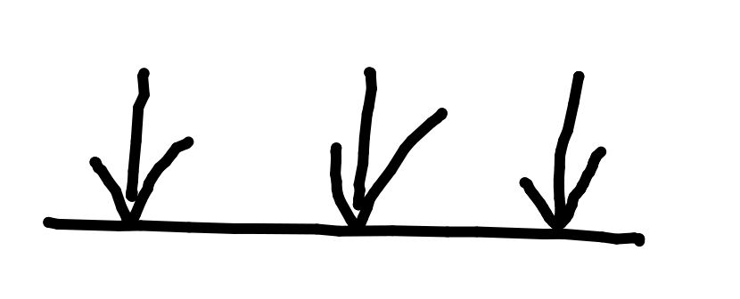

# Gravitational Fields

Field - Region of space in which a point is affected by a non-contact force.

Gravitational fields follow the inverse-square rule.

#### Radial Field:
All lines radiate towards/away from central point. Further away is field lines become less concentrated so field is weaker.

#### Uniform Field:

Field stregth same magnitude and direction throughout the field. Field lines parallel.

## Field Strength

Strength of a gravitational field is the force per unit mass, for a test mass placed in a field.

## Gravitational Potential:

$V$ at a point is the work done per unit mass to move a small object from infinity to a point.

$V_{(gravitational\ potential,\ Jkg^-1)}= {
{W_{(work\ done)}}
\over
{M}
}$

$\Delta W = m \Delta V$

$g = -
{{\Delta V_{(change\ in\ potential)}}
\over
{\Delta r_{(change\ in\ distance)}}
}$

$g = {F_{(force)} \over m_{(mass)}}$

## Laws of Gravitation

$F_{gravity} = {
{G M_1 M_2}
\over
{r^2}
}$

The forces on each body are the same, but mass difference causes differences in acceleration.

## Planetary Fields

$g = {F
\over
m} = {
{G M_{(Larger\ mass)}}
\over
{r^2_{(radius\ of\ larger\ mass)}}
}$

$V_{(Gravitational\ potential)} = -{
{GM}
\over
{r}
}$

## Escape Velocity

$\Delta W = m \Delta V = m{
{GM}
\over
{R}
}= {
{GMm}
\over
{R}
}$

${1\over 2} mv^2 \ge {
{GMm}
\over
{R}
}$

${1\over 2} mv^2 = {
{GMm}
\over
{R}
}$

$v_{(Escape\ velocity)} =  \sqrt{
{2GM}
\over
{R}
}$

$g = {
{GM}
\over
{r^2}
}  \therefore V = \sqrt{2gR}$

## Graphs

Gravitational field strength: $1 \over {r^2}$

Gravitational potential: $-{1 \over r}$

