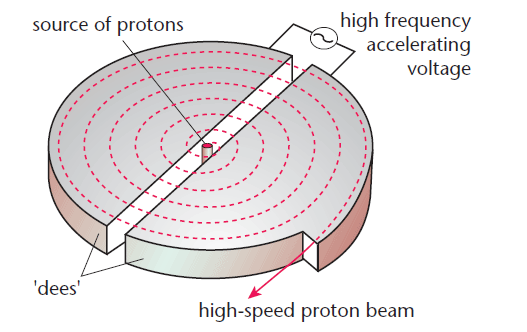

# Magnetic Fields

Straight wires with current are surrounded by a circular, uniform magnetic field.

Force affected by:

- Field strength.

- Current

- Wire length

Tesla = 1N per A

$\therefore B = {N \over I}$

$F = BIL$

Force on moving charge, $F = BQv$.

At an angle: $F = BQv\sin(\theta)$

## Particles in Circular Motion

Force perpendicular to velocity, so no work is done.

$F = {
{mv^2}
\over
{r}
}$

$F = BQv$

$\therefore BQv = {
{mv^2}
\over
{r}
}$

$r = {
{mv}
\over
{BQ}
}$

Radius is increased by:

- Higher mass, m

- Higher velocity, v

- Lower magnetic field strength, B

- Lower charge, Q

## Cyclotron

Charged particles are fired into dees.

Particles accelerated.

Voltage AC so reverses particle to allow constant acceleration in every direction.

