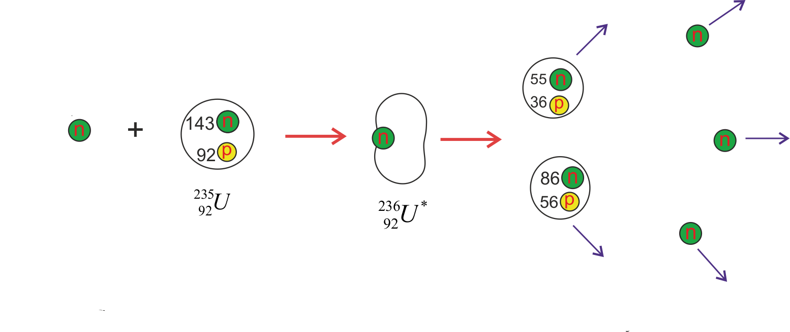

# Fission and Fusion

## Fission

Splitting large nucleus afer absorbing a neutron. This splits into smaller nuclei, 2-3 neutrons and energy.

Neutrons always swapping about. Usually there are enough nucleons to stop the EM force tearing the nucleus apart.

Bombarding unstable nuclei with neutrons causes the EM force to tear the nucleus apart, leading to fission.

Neutrons must have the correct $E_k$:

- Too many - neutrons pass straight through the nucleus.

- Too few - neutrons bounce off nucleus.

## Fusion

2 nuclei come together to form a larger nucleus.

Each nucleus must have enough energy to:

- Overcome electrostatic repulsion.

- Overcome strong force.

#### Fusion examples:

$^1_1 P + ^1_1 P \rightarrow ^2_1 H + ^0_{-1}\beta + V_e$

$^2_1 H + ^1_1 P \rightarrow ^3_2 He$

$^3_2 He + ^3_2 He \rightarrow ^4_2 He + 2^1_1 P$