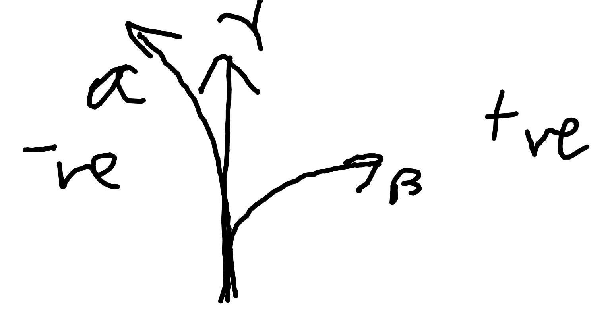

# Nuclear Particles

Paper stops $\alpha$.

Aluminium stops $\beta$.

Thick lead absorbs most $\gamma$ but not all.

$\alpha$ most ionising as it knocks electrons off atoms.

$\gamma$ least ionising.

## In a Magnetic Field

Particles follow Fleming's left-hand rule.

## $\gamma$ Particles

Follows inverse square law.