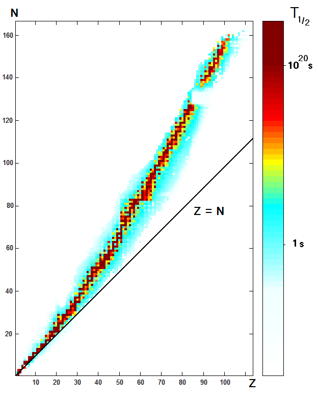

# Radioactivity

$C_{(corrected\ count\ rate)} = C_{1 (measured\ rate} - C_{0 (background\ rate)}$

## Dangers

The Sievert (Sv) combines exposure (counts per second) with the type of radiation.

Maximum limit is 20 mSv/year.

10 mSv/year limit practised in nuclear industry.

## Precautions

Handle solids with tongs/tweezers only, never directly.

Gases/liquids are kept in sealed containers to stop ingestion.

Radiation sources are used for the minimum possible time.

## Decay

Rate of decay $\propto$ amount of nuclei.

Activity decreases exponentially.

$m_{t(mass\ remaining)} = 0.5^{n_{(number\ of\ half-lives)}}M_{0(original\ mass)}$

Activity = disintegrations per second, measured in Becquerels (Bq) or s^-1 .

Energy is released during decay, carried away by an $\alpha/\beta$ particle.

$P_{(power)} = A_{(activity)}E_{(energy)}$

$t = {1 \over A}$

$\Delta N = -\lambda_{(decay\ constant)} N_{(num.\ atoms)} \Delta t$

$A = A_{0(initial\ activity)} e^{-\lambda t}$

$A = \lambda N$

## Decay Modes

This shows the relationship between decay type and number of protons(Z) and neutrons(N).

Up to $Ca$, isotopes have approximately the same number of protons and neutrons.

Beyond $Ca$ there are slightly more neutrons than protons.

Isotopes without the correct ratio of protons to neutrons decay quickly, because protons feel the EM force, causing more protons to push apart the nucleus.

Both neutrons and protons feel the strong force so adding these pulls the nucleus together.

So when N=P the nucleus is stable, but more protons causes the nucleus to be pushed apart.